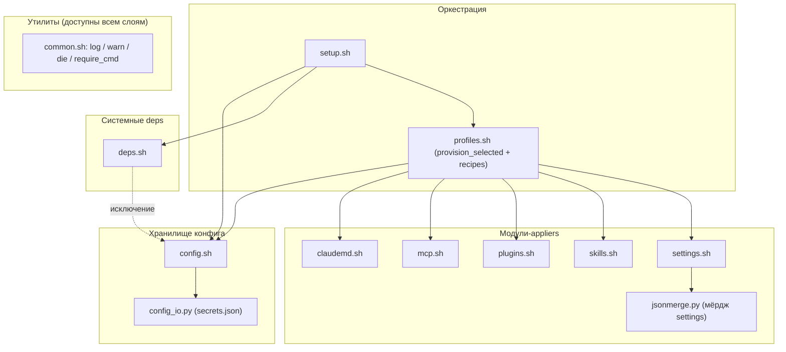
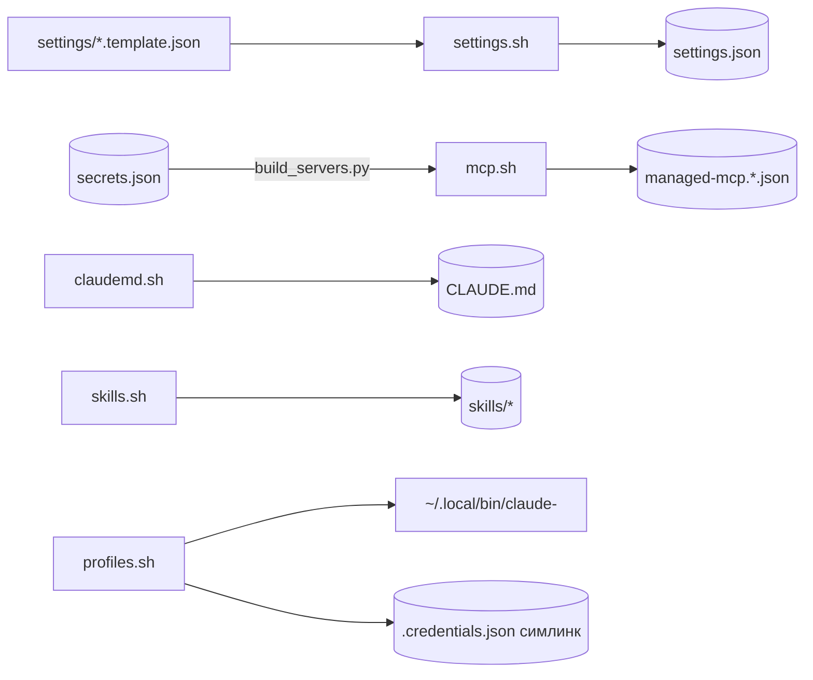

# Архитектура claudefiles

Тех-диаграммы деплоя: структура модулей, потоки данных, прогон `setup.sh`, разница профилей. Правятся в том же PR, что и код. Лейблы однострочные ради рендера в Linear.

## Компоненты по слоям

Слои по ответственности, стрелки вниз. `common.sh`, утилиты, доступны всем слоям (не рисуем 8 стрелок). Единственное обратное ребро-исключение помечено пунктиром: `_chromium_present`→`config` (deps.sh:58).

## Потоки данных

Что откуда читается и куда пишется при деплое. Цилиндры - персистентные стора.

