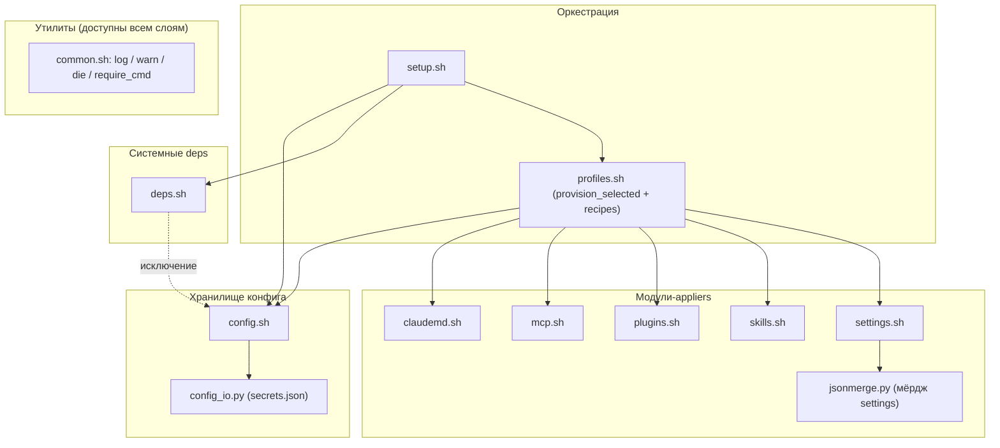
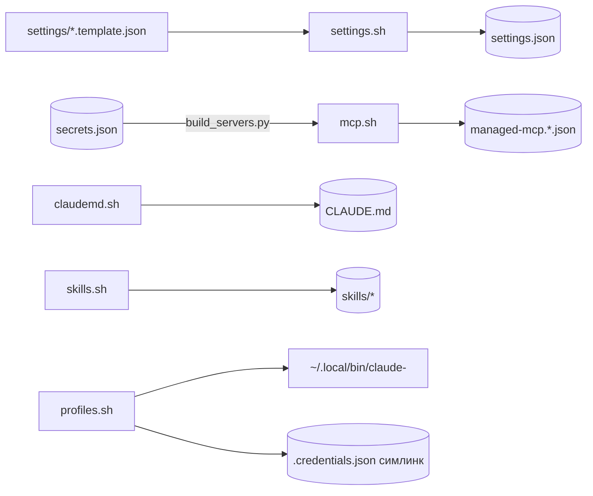
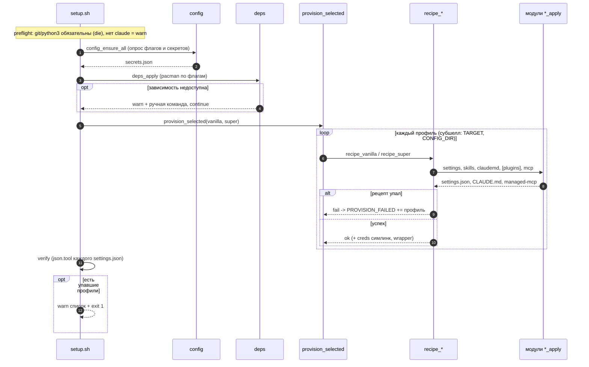
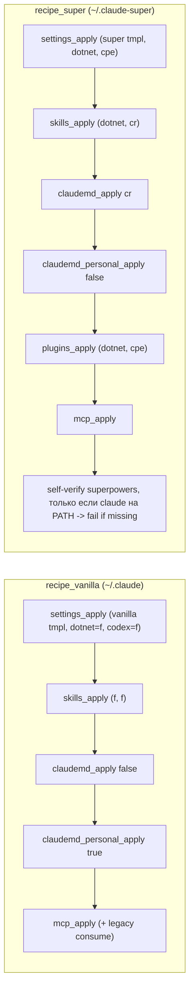

# Архитектура claudefiles

Тех-диаграммы деплоя: структура модулей, потоки данных, прогон `setup.sh`, разница профилей. Правятся в том же PR, что и код. Лейблы однострочные ради рендера в Linear.

## Компоненты по слоям

Слои по ответственности, стрелки вниз. `common.sh`, утилиты, доступны всем слоям (не рисуем 8 стрелок). Единственное обратное ребро-исключение помечено пунктиром: `_chromium_present`→`config` (deps.sh:58).

## Потоки данных

Что откуда читается и куда пишется при деплое. Цилиндры - персистентные стора.

## Прогон setup.sh

Один деплой сверху вниз. По фичам не фатально (deps, отсутствие `claude`). Фатально: нет `git`/`python3` на preflight (`require_cmd`), нет обязательного конфига без TTY (config.sh:30), exit 1 при упавших профилях (setup.sh:79).

## Рецепты: vanilla vs super

Ключевые отличия: vanilla не зовёт `plugins_apply` и self-verify, передаёт `_mcp_legacy` для consume, personal-блок `CLAUDE.md` включён (у super - выключен).

## Слои коротко

- Оркестрация (`setup.sh`, `profiles.sh`) знает фазы и рецепты; провижн каждого профиля идёт в субшелле с экспортом `CLAUDEFILES_TARGET` и `CLAUDE_CONFIG_DIR` (profiles.sh:73).
- Модули-appliers идемпотентны и владеют своим артефактом; `jsonmerge.py`: только логика мёрджа settings, `config_io.py`: только хранилище секретов.
- Все стора секретов пишутся с `chmod 600` (`config_io.py:42-44`, `mcp.sh:26`).
