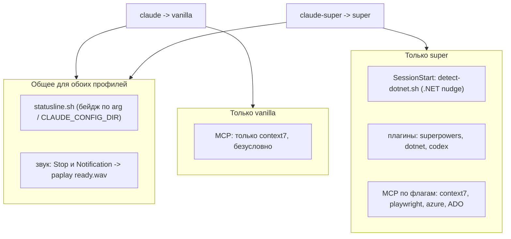

# Runtime claudefiles

Что работает в живой сессии `claude`/`claude-super`. Явно разделено общее и super-only: ваниль не такая пустая, как кажется (звук хода есть у обоих).

- **statusline** (statusline.sh): бейдж профиля из аргумента настроек или из `CLAUDE_CONFIG_DIR`; cyan=vanilla, magenta=super, yellow=прочее.
- **звук** (оба шаблона, `paplay` на Stop и Notification; vanilla:11 / super:25): `ready.wav`.
- **SessionStart** (только super): `detect-dotnet.sh` ищет .NET в дереве и подсказывает `dotnet-router`.
- **MCP**: vanilla всегда только context7 (build_servers.py:23-28); super: флаг-гейтед набор, куда context7 входит тоже по флагу (build_servers.py:29-46).
