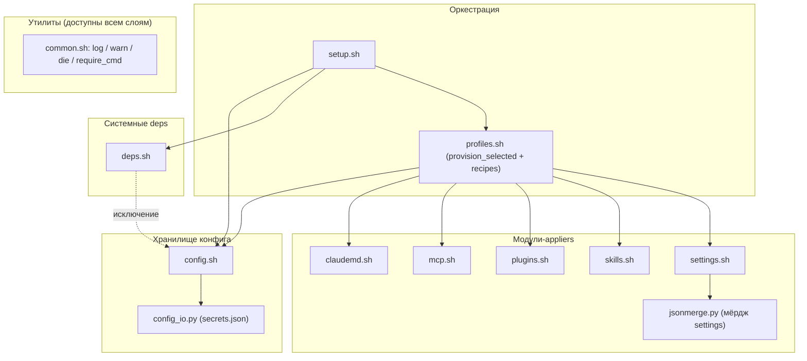
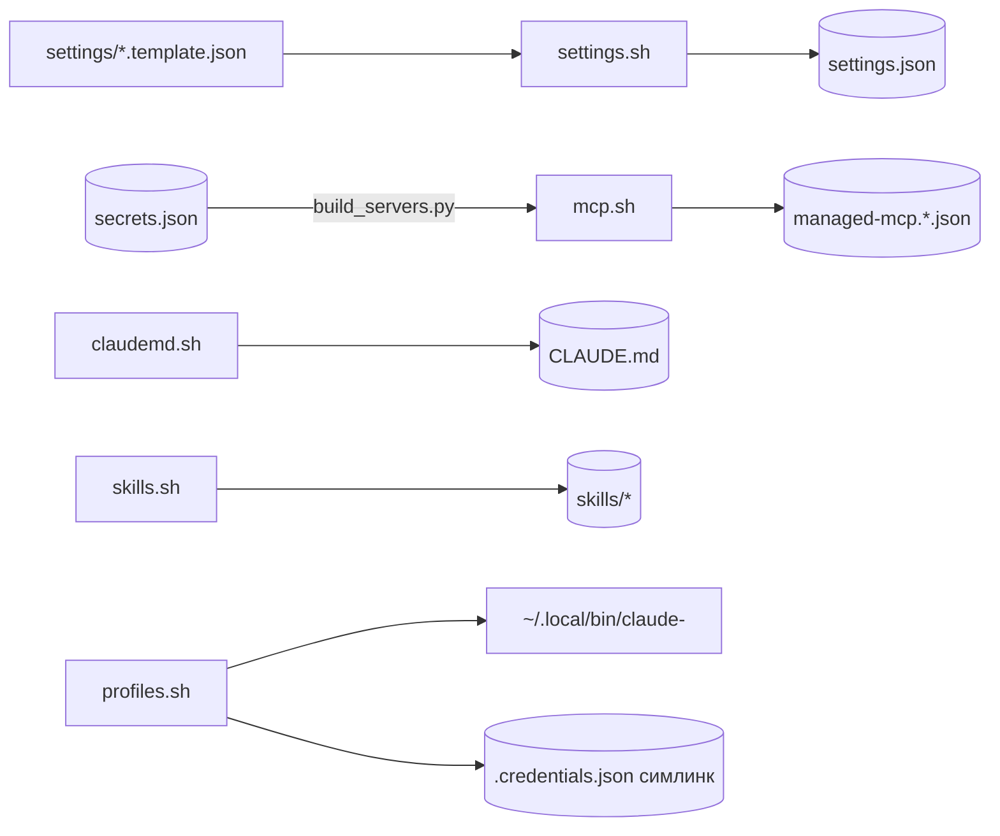
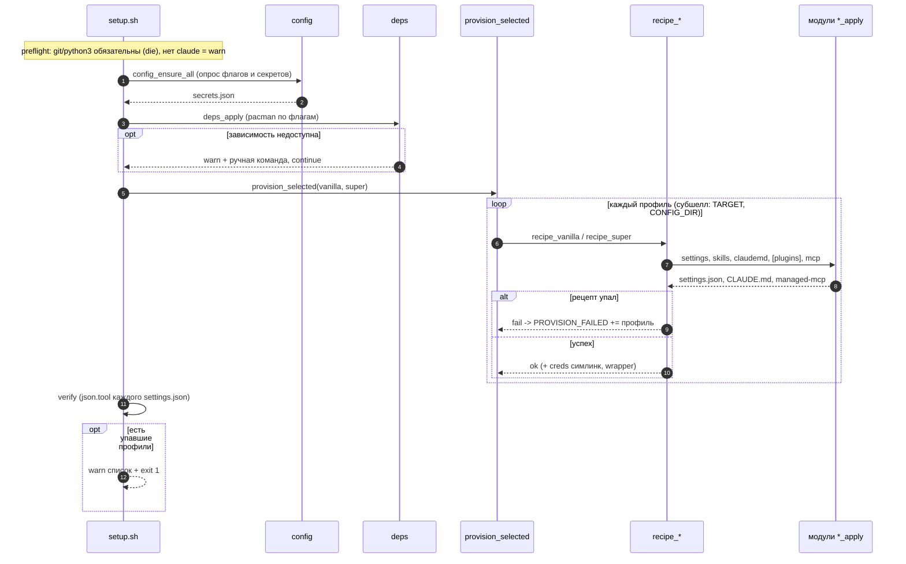
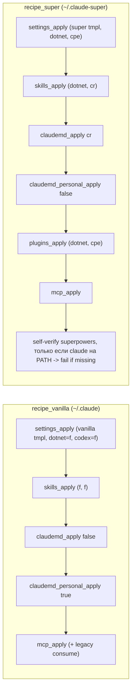
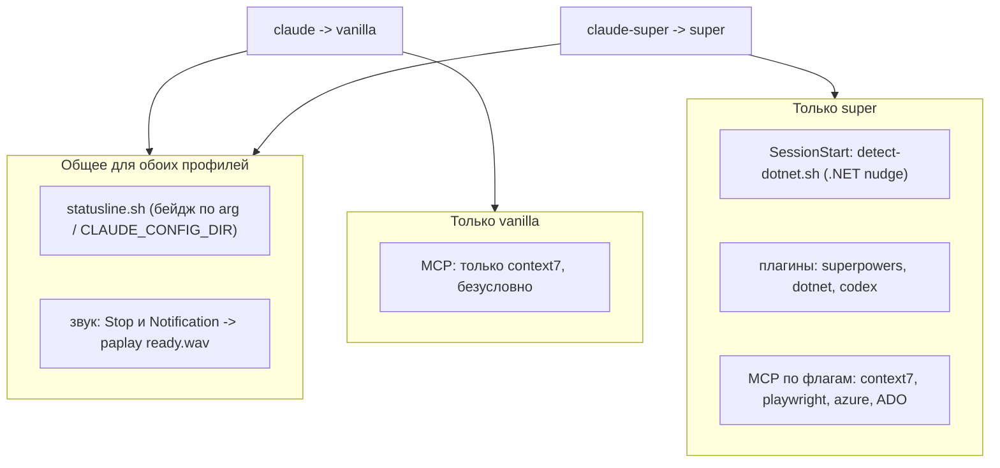

# Документация проекта и диаграммы — план реализации

> **For agentic workers:** REQUIRED SUB-SKILL: Use superpowers:subagent-driven-development (recommended) or superpowers:executing-plans to implement this plan task-by-task. Steps use checkbox (`- [ ]`) syntax for tracking.

**Goal:** Набор фокусных Mermaid-диаграмм и доков в `docs/`, по которым систему понятно без чтения кода.

**Architecture:** Разбить перегруженную тех-диаграмму на 6 фокусных вьюх (компонентная, data-flow, deploy-sequence, recipe-diff, runtime, user-flow) и 5 доков. Динамику рисуем `sequenceDiagram`, статику — слоёными `subgraph`. Всё рендерится `mmdc`, проверяется до коммита.

**Tech Stack:** Mermaid, `@mermaid-js/mermaid-cli` (`mmdc`) через `npx`, chromium из кеша puppeteer.

## Global Constraints

Действуют для КАЖДОЙ задачи:

- **Без `<br/>`** в лейблах диаграмм (рендерер Mermaid в Linear падает). Многострочность — скобки/запятая.
- **Один срез = одна вьюха** под своим H2. `architecture.md` держит ровно 4 диаграммы в заданном порядке, не больше.
- **Бюджет узлов** ≤ ~12 на диаграмму. Одно направление раскладки (TD или LR).
- **Обратные рёбра-исключения** — пунктиром с подписью.
- **В тексте `Note` у `sequenceDiagram` нельзя `;` и `->`** — mermaid падает с parse error. Проверено. Заменять на запятую и словами. Все 6 диаграмм отрендерены `mmdc` при написании плана.
- **Подсветка обсуждаемого** — класс `new` (`classDef new fill:#ffd54f,stroke:#f57f17,stroke-width:2px;` + `:::new`).
- **Стиль текста:** коротко и прямо, без эмодзи и длинных тире. Не использовать «ensure/leverage/robust/seamless/utilize». Русская проза, английские идентификаторы в моноширинном. Ссылки на код — `file:line`.
- **Команда рендера** (объективный гейт, exit-0 + число диаграмм == ожидаемому):

```bash
CHROME="$(find ~/.cache/puppeteer -name chrome -type f | head -1)"
PUPPETEER_EXECUTABLE_PATH="$CHROME" \
  npx -y @mermaid-js/mermaid-cli -i docs/<file>.md -o /tmp/<file>.png -b white
```

- **Проверка `<br/>`:** `! grep -rn '<br/>' docs/*.md` (пустой вывод = exit-0; голый `grep` при пустом выводе даёт exit 1 и ломает гейт).
- Вживую на рендер проверены только компонентная и sequence. Остальные Mermaid-блоки исполнитель обязан отрендерить сам, оценить читаемость глазами, при кривой раскладке подстроить, закоммитить.

---

## Фаза 1 — architecture.md + invariants.md (чинит главную боль)

### Task 1: Ветка и компонентная диаграмма

**Files:**
- Create: `docs/architecture.md` (перезапись существующей версии из спайка)

**Interfaces:**
- Produces: `docs/architecture.md` с H2 `## Компоненты по слоям` и первой диаграммой.

- [ ] **Step 1: Создать ветку**

```bash
git checkout -b stsiapantsikhanau/sts-73-docs-diagrams
git add docs/superpowers/specs/2026-07-14-project-docs-diagrams-design.md docs/superpowers/plans/2026-07-14-project-docs-diagrams.md
git commit -m "docs(sts-73): spec и план набора диаграмм"
```

- [ ] **Step 2: Записать `docs/architecture.md` с интро и компонентной диаграммой**

Полное содержимое файла на этом шаге:

````markdown
# Архитектура claudefiles

Тех-диаграммы деплоя: структура модулей, потоки данных, прогон `setup.sh`, разница профилей. Правятся в том же PR, что и код. Лейблы однострочные (без `<br/>`) ради рендера в Linear.

## Компоненты по слоям

Слои по ответственности, стрелки вниз. `common.sh` — утилиты, доступны всем слоям (не рисуем 8 стрелок). Единственное обратное ребро-исключение помечено пунктиром: `_chromium_present`→`config` (deps.sh:58).


````

- [ ] **Step 3: Отрендерить и проверить**

```bash
CHROME="$(find ~/.cache/puppeteer -name chrome -type f | head -1)"
PUPPETEER_EXECUTABLE_PATH="$CHROME" npx -y @mermaid-js/mermaid-cli -i docs/architecture.md -o /tmp/arch.png -b white
! grep -n '<br/>' docs/architecture.md
```
Expected: `Found 1 mermaid charts`, exit-0; grep пуст. Глазами: слои сверху вниз, `jsonmerge` висит на `settings`, пунктирное ребро `deps→config` помечено.

- [ ] **Step 4: Commit**

```bash
git add docs/architecture.md
git commit -m "docs(sts-73): компонентная диаграмма по слоям"
```

### Task 2: Data-flow хранилищ

**Files:**
- Modify: `docs/architecture.md` (добавить H2 `## Потоки данных`)

**Interfaces:**
- Consumes: `docs/architecture.md` из Task 1.

- [ ] **Step 1: Дописать секцию в `docs/architecture.md`**

````markdown
## Потоки данных

Что откуда читается и куда пишется при деплое. Цилиндры — персистентные стора.


````

- [ ] **Step 2: Отрендерить и проверить**

```bash
CHROME="$(find ~/.cache/puppeteer -name chrome -type f | head -1)"
PUPPETEER_EXECUTABLE_PATH="$CHROME" npx -y @mermaid-js/mermaid-cli -i docs/architecture.md -o /tmp/arch.png -b white
```
Expected: `Found 2 mermaid charts`, exit-0. Глазами: LR, стрелки слева направо, минимум пересечений.

- [ ] **Step 3: Commit**

```bash
git add docs/architecture.md
git commit -m "docs(sts-73): data-flow хранилищ"
```

### Task 3: Deploy-sequence с путями деградации

**Files:**
- Modify: `docs/architecture.md` (добавить H2 `## Прогон setup.sh`)

- [ ] **Step 1: Дописать секцию**

````markdown
## Прогон setup.sh

Один деплой сверху вниз. По фичам не фатально (deps, отсутствие `claude`). Фатально: нет git/python3 на preflight (`require_cmd`), нет обязательного конфига без TTY (config.sh:30), exit 1 при упавших профилях (setup.sh:79).


````

- [ ] **Step 2: Отрендерить и проверить**

```bash
CHROME="$(find ~/.cache/puppeteer -name chrome -type f | head -1)"
PUPPETEER_EXECUTABLE_PATH="$CHROME" npx -y @mermaid-js/mermaid-cli -i docs/architecture.md -o /tmp/arch.png -b white
```
Expected: `Found 3 mermaid charts`, exit-0. Глазами: линейно, видны `opt`/`alt` ветки деградации.

- [ ] **Step 3: Commit**

```bash
git add docs/architecture.md
git commit -m "docs(sts-73): deploy-sequence с путями деградации"
```

### Task 4: Recipe-diff vanilla vs super + прозаический хвост

**Files:**
- Modify: `docs/architecture.md` (добавить H2 `## Рецепты: vanilla vs super` и короткий текст по слоям)

- [ ] **Step 1: Дописать диаграмму и прозаический хвост**

````markdown
## Рецепты: vanilla vs super

Ключевые отличия: vanilla не зовёт `plugins_apply` и self-verify, передаёт `_mcp_legacy` для consume, personal-блок `CLAUDE.md` включён (у super — выключен).



## Слои коротко

- Оркестрация (`setup.sh`, `profiles.sh`) знает фазы и рецепты; провижн каждого профиля идёт в субшелле с экспортом `CLAUDEFILES_TARGET` и `CLAUDE_CONFIG_DIR` (profiles.sh:73).
- Модули-appliers идемпотентны и владеют своим артефактом; `jsonmerge.py` — только логика мёрджа settings, `config_io.py` — только хранилище секретов.
- Все стора секретов пишутся с `chmod 600` (config_io.py:42-44, mcp.sh).
````

- [ ] **Step 2: Отрендерить и проверить**

```bash
CHROME="$(find ~/.cache/puppeteer -name chrome -type f | head -1)"
PUPPETEER_EXECUTABLE_PATH="$CHROME" npx -y @mermaid-js/mermaid-cli -i docs/architecture.md -o /tmp/arch.png -b white
! grep -n '<br/>' docs/architecture.md
```
Expected: `Found 4 mermaid charts`, exit-0; grep пуст. Глазами: два отдельных рецепта (mermaid может уложить их стопкой, а не бок-о-бок — это ок, проверено), отличия читаются: у vanilla нет `plugins_apply` и self-verify, personal-блок инвертирован.

- [ ] **Step 3: Commit**

```bash
git add docs/architecture.md
git commit -m "docs(sts-73): recipe-diff vanilla vs super"
```

### Task 5: invariants.md

**Files:**
- Create: `docs/invariants.md`

- [ ] **Step 1: Записать `docs/invariants.md`**

Полное содержимое (перед коммитом сверить каждый `file:line` тестов в `skills/tools/`):

````markdown
# Инварианты claudefiles

Гарантии, которые держит тест-сьют (`skills/tools/`). Каждая строка — гарантия и тест-источник.

- **Идемпотентность / zero-diff на повторный прогон.** Второй `setup.sh` не меняет ни settings, ни CLAUDE.md, ни MCP-манифест, ни плагины. Тесты: `test-setup-idempotent.sh`, `test-multiprofile.sh`, покомпонентно `test-mcp.sh`, `test-plugins.sh`, `test-claudemd.sh`.
- **Секреты с `chmod 600`.** `secrets.json` и `managed-mcp.*.json` создаются и переписываются в 600. Тесты: `test-config.sh`, `test-mcp.sh`.
- **Секреты не в git.** `secrets.json`, `managed-mcp.json`, `last-applied-head`, `.env` не трекаются. Тест: `test-secrets-not-tracked.sh`.
- **Изоляция профилей.** Рецепты в субшелле без утечки env в вызывающего; отдельный target-каталог; отдельные MCP-манифесты. Тесты: `test-profiles.sh`, `test-settings.sh`, `test-skills.sh`.
- **Миграция super→vanilla полная и одноразовая.** Плагины/хуки/model/effort/router/super-MCP снимаются с дефолтного каталога, пользовательский контент и неизвестные ключи сохраняются. Тесты: `test-multiprofile.sh`, `test-settings.sh`.
- **Неклоббер чужих артефактов.** Немаркированные wrapper и `.credentials.json` не трогаются. Тест: `test-profiles.sh`.
- **Whole-token матчинг.** Детект плагинов и зависимостей не срабатывает на подстроках. Тесты: `test-deps.sh`, `test-plugins.sh`.
- **Робастность statusline.** Не падает и не даёт трейсбек на битых/инъекционных полях; бейдж всегда крайний слева и санитайзится. Тест: `test-statusline.sh`.
- **Не фатально по дизайну.** deps и plugins не роняют `setup.sh` под `set -e`, печатают ручную команду и продолжают. Тесты: `test-deps.sh`, `test-plugins.sh`.
````

- [ ] **Step 2: Сверить факты и проверить `<br/>`**

```bash
ls skills/tools/test-*.sh
! grep -n '<br/>' docs/invariants.md
```
Expected: перечисленные тест-файлы существуют; grep пуст.

- [ ] **Step 3: Commit**

```bash
git add docs/invariants.md
git commit -m "docs(sts-73): инварианты из тест-сьюта"
```

---

## Фаза 2 — runtime.md + config-schema.md + user-flow + README

### Task 6: runtime.md

**Files:**
- Create: `docs/runtime.md`

- [ ] **Step 1: Записать `docs/runtime.md`**

````markdown
# Runtime claudefiles

Что работает в живой сессии `claude`/`claude-super`. Явно разделено общее и super-only: ваниль не такая пустая, как кажется (звук хода есть у обоих).



- **statusline** (statusline.sh): бейдж профиля из аргумента настроек или из `CLAUDE_CONFIG_DIR`; cyan=vanilla, magenta=super, yellow=прочее.
- **звук** (оба шаблона, `paplay` на Stop и Notification; vanilla:11 / super:25): `ready.wav`.
- **SessionStart** (только super): `detect-dotnet.sh` ищет .NET в дереве и подсказывает `dotnet-router`.
- **MCP**: vanilla всегда только context7 (build_servers.py:23-28); super — флаг-гейтед набор, куда context7 входит тоже по флагу (build_servers.py:29-46).
````

- [ ] **Step 2: Отрендерить и проверить**

```bash
CHROME="$(find ~/.cache/puppeteer -name chrome -type f | head -1)"
PUPPETEER_EXECUTABLE_PATH="$CHROME" npx -y @mermaid-js/mermaid-cli -i docs/runtime.md -o /tmp/runtime.png -b white
! grep -n '<br/>' docs/runtime.md
```
Expected: `Found 1 mermaid charts`, exit-0; grep пуст. Глазами: два блока, ваниль тянет только shared, super — оба.

- [ ] **Step 3: Commit**

```bash
git add docs/runtime.md
git commit -m "docs(sts-73): runtime-сессия, общее vs super-only"
```

### Task 7: config-schema.md

**Files:**
- Create: `docs/config-schema.md`

- [ ] **Step 1: Записать `docs/config-schema.md`**

````markdown
# Схема secrets.json

`~/.config/claudefiles/secrets.json` — единственный persist пользовательских ответов. Владеет им `config_io.py` (пишет с `chmod 600` на создании и на каждой записи, config_io.py:42-44).

## Ключи

- `flags.<name>` — булевы (JSON-bool): `profile_super`, `dotnet_skills`, `codex_review`, `codex_plugin`, `playwright`, `azure_mcp`, `ado`, `context7`.
- `ado.email`, `ado.orgs` (массив), `ado.pat.<org>` (секрет per-org).
- `context7_api_key` (секрет, пусто = free tier).
- `playwright.chromium_path` (override пути к chromium).

## Семантика записи

- **Prompt-once для флагов** (config.sh:48): раз спросили — больше не переспрашиваем.
- **Optional пишет пусто** (config.sh:42): пустой ответ сохраняется, `config_has` в следующий прогон вернёт true, повтора нет.
- **present-empty vs absent**: ключ с пустым значением != отсутствующий ключ; на этом стоит prompt-once.
- **Булевы** эмитятся lowercase (`true`/`false`), чтобы shell-сравнение работало.
- **Легаси-строка `"true"`** терпится наравне с JSON-bool в MCP-конфиге (build_servers.py:8-10).

Обоснование: config.sh, config_io.py, build_servers.py.
````

- [ ] **Step 2: Сверить и проверить `<br/>`**

```bash
! grep -n '<br/>' docs/config-schema.md
```
Expected: grep пуст. Факты сверены с config.sh / config_io.py / build_servers.py.

- [ ] **Step 3: Commit**

```bash
git add docs/config-schema.md
git commit -m "docs(sts-73): схема secrets.json"
```

### Task 8: Освежить user-flow.md под конвенции

**Files:**
- Modify: `docs/user-flow.md`

**Interfaces:**
- Consumes: существующий `docs/user-flow.md` (диаграмма 6, уже без `<br/>`).

- [ ] **Step 1: Исправить фактическую ошибку и конвенции**

В диаграмме `docs/user-flow.md` оба профиля ведут в один узел с `dotnet-nudge`, но `detect-dotnet.sh` — SessionStart-хук только у super (у vanilla нет SessionStart). Разделить исход. Точная правка:

old:
```
  out1 --> ux["бейдж в статуслайне, звук хода, dotnet-nudge в .NET"]
  out2 --> ux
```
new:
```
  out1 --> ux1["бейдж в статуслайне, звук хода"]
  out2 --> ux2["бейдж, звук хода, dotnet-nudge в .NET"]
```

Плюс убедиться, что H1 согласован с остальными доками и интро-строка про Linear на месте.

- [ ] **Step 2: Отрендерить и проверить**

```bash
CHROME="$(find ~/.cache/puppeteer -name chrome -type f | head -1)"
PUPPETEER_EXECUTABLE_PATH="$CHROME" npx -y @mermaid-js/mermaid-cli -i docs/user-flow.md -o /tmp/flow.png -b white
! grep -n '<br/>' docs/user-flow.md
```
Expected: `Found 1 mermaid charts`, exit-0; grep пуст.

- [ ] **Step 3: Commit (если были правки)**

```bash
git add docs/user-flow.md
git commit -m "docs(sts-73): user-flow под общие конвенции" || echo "нет изменений"
```

### Task 9: Ссылки в README + финальный гейт

**Files:**
- Modify: `README.md` (раздел `## Раскладка` — добавить ссылки на доки)

- [ ] **Step 1: Добавить в README раздел ссылок на доки**

В раздел `## Раскладка` (README.md:92) дописать список:

```markdown
Документация:
- [docs/architecture.md](docs/architecture.md) — структура, потоки, прогон, рецепты
- [docs/runtime.md](docs/runtime.md) — поведение живой сессии
- [docs/user-flow.md](docs/user-flow.md) — что запускает пользователь
- [docs/invariants.md](docs/invariants.md) — гарантии тест-сьюта
- [docs/config-schema.md](docs/config-schema.md) — схема secrets.json
```

- [ ] **Step 2: Финальный объективный гейт**

```bash
CHROME="$(find ~/.cache/puppeteer -name chrome -type f | head -1)"
for f in architecture user-flow runtime; do
  PUPPETEER_EXECUTABLE_PATH="$CHROME" npx -y @mermaid-js/mermaid-cli -i docs/$f.md -o /tmp/$f.png -b white
done
! grep -rn '<br/>' docs/*.md
```
Expected: architecture=4, user-flow=1, runtime=1 (итого 6 диаграмм), все exit-0; grep по `<br/>` пуст.

- [ ] **Step 3: Commit**

```bash
git add README.md
git commit -m "docs(sts-73): ссылки на доки в README"
```

---

## Self-Review (выполнено при написании плана)

- **Покрытие спеки:** 6 диаграмм → Task 1-4, 6, 8; 5 доков → architecture (T1-4), invariants (T5), runtime (T6), config-schema (T7), user-flow (T8); README-ссылки → T9. Стадийность спеки (фаза 1/2) отражена в разбивке. Пробелов нет.
- **Плейсхолдеры:** нет; каждый диаграммный Task несёт готовый Mermaid, каждый doc-Task — готовый markdown.
- **Согласованность типов:** имена файлов и H2-заголовки совпадают между задачами и финальным гейтом; счётчик диаграмм (4+1+1=6) сходится.
