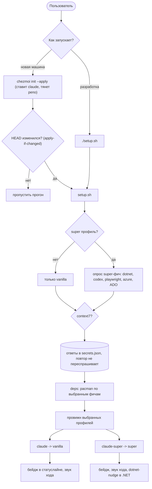

# User-flow claudefiles

Что пользователь запускает и что происходит: bootstrap через chezmoi против прямого прогона, опрос фич, провижн профилей.

Лейблы однострочные ради рендера в Linear.

```mermaid
flowchart TD
  start([Пользователь]) --> how{"Как запускает?"}
  how -->|"новая машина"| chez["chezmoi init --apply (ставит claude, тянет репо)"]
  how -->|"разработка"| direct["./setup.sh"]

  chez --> gate{"HEAD изменился? (apply-if-changed)"}
  gate -->|нет| skip["пропустить прогон"]
  gate -->|да| run
  direct --> run["setup.sh"]

  run --> q{"super профиль?"}
  q -->|нет| onlyv["только vanilla"]
  q -->|да| feats["опрос super-фич: dotnet, codex, playwright, azure, ADO"]
  onlyv --> c7{"context7?"}
  feats --> c7
  c7 --> persist[("ответы в secrets.json, повтор не переспрашивает")]

  persist --> deps["deps: pacman по выбранным фичам"]
  deps --> provision["провижн выбранных профилей"]
  provision --> out1["claude -> vanilla"]
  provision --> out2["claude-super -> super"]
  out1 --> ux1["бейдж в статуслайне, звук хода"]
  out2 --> ux2["бейдж, звук хода, dotnet-nudge в .NET"]
```
